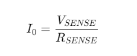

<!-- Please do not change this logo with link -->

# Low-Power AVR EA Current Measurement

This example shows how to use the AVR EA microcontoller to measure a current by using the Analog-to-Digital (ADC) peripheral. The only hardware needed, in addition to the microcontroller, are two 100 kΩ resistors and one 10 kΩ resistor.  

## Hardware Used

- [AVR64EA48 Curiosity Nano](https://www.microchip.com/en-us/development-tool/EV66E56A)
- 10 kΩ Resistor
- 2×100 kΩ Resistor  

## Test Setup

- PORTA Pin 7 is set as output (only used as debug pin)
- PORTD Pin 6 is DAC0 Out, connected to R1
- PORTD Pin 1 is ADC0 Positive Input 1, connected to RSENSE
- PORTD Pin 0 is ADC0 Negative Input 0, connected after RSENSE

## Peripherals Configuration Using MPLAB® Core Configurator (MCC) Melody

Add the required peripherals: ADC0, DAC0, RTC, UART1 and SLPCTRL. These are found under Drivers in the Device Resources window. Press the green "plus" sign to add to Project Resources, this will also make the peripheral show in the Builder view. Note that the peripheral VREF is added automatically when ADC0 or DAC0 is added, since these peripherals require the VREF peripheral. These System peripherals are added automatically: CLKCTRL, Configuration Bits, Interrupt Manager, Main and Pins.  

### System Configuration: CLKCTRL

- Set the Clock Selection to "Internal high-frequency oscillator"
- Enable the Prescaler
- Set Prescaler Division to "Divide by 2"

This will give a Main Clock of 10000000 Hz (10 MHz). Notice that the Timebase is automatically set to "10".

### System Configuration: Interrupt Manager

- Enable Global Interrupt  

 

### System Configuration: SLPCTRL

- Turn on Sleep Enable
- For Sleep Mode, select "PDOWN"  

### System Configuration: Pin Config

If Pin Config window does not appear, click the **Pin Grid View** tab at the bottom as indicated by the red arrow.

- PORTC Pin 0 is used by USART1 as TXD output
- PORTD Pin 0 and 1 is used by the ADC0 as analog inputs
- PORTD Pin 6 is used by the DAC0 an output  

- In the Pins configuration, PORTB pin 3 is renamed "LED0" to indicate this pin is connected to LED0 on the Curiosity Nano board
- For all used pins Input/Sense Configuration (ISC) is set to "Digital Input Buffer Disabled" to save power  

  

### Peripherals Configuration: VREF Configuration

- Set VDD to 3.3V
- Turn on the Enable Force DAC Voltage Reference
- Set DAC Voltage Reference source to "VDD as reference"  

### Peripherals Configuration: RTC Configuration

- Turn on Enable RTC
- Select "Internal 32 kHz Oscillator divided by 32" clock select
- Turn on PIT Enable
- Under Periodic Interrupt Timer set Period Selection to "RTC Clock Cycles 1024"  

### Peripherals Configuration: DAC0 Configuration

- Turn on Enable DAC
- Turn on Enable Output on DAC
- Set required voltage to 1.0V  

### Peripherals Configuration: ADC0 Configuration

In ADC Clock Settings:  

- Select Prescaler Value "System Clock Divided by 10"
- Sample Duration 12  

In Hardware Settings:  

- Turn on ADC Enable
- Set mode to "BURST"
- Turn on Differential mode
- Set Sample numbers to 16 samples accumulated
- Set Start command to start a conversion immediatley
- Set Reference select to "VDD" (in this example VDD is 3.3V)
- Set first analog channel selection bits (MUXPOS) to "ADC input pin 1"
- Set second analog channel selection bits (MUXNEG) to "ADC input pin 0"
- Set Analog inputs Via to "Inputs connected via PGA"
- Set Sign Chopping to "Enable"

In PGA Control Settings:  

- Turn on Enable PGA
- Set PGA BIAS Select to 100% BIAS current
- Set Gain to 16x gain  

### Peripherals Configuration: USART1 Configuration

We are using USART1 because the Rx and Tx pins of USART1 are accessible over the USB interface for the Curiosity Nano board. See the Curiosity Nano User Manual for more information.

In the "USART1_Peripheral" configuration:

- Turn on Enable USART Receiver
- Turn on Enable USART Transmitter  

In the "UART1" configuration:

- For Requested Baudrate write "115200"  

For the rest we use the default settings, so 8 data bits, 1 stop bit, no parity and no flow control.  

### Adding Support for Sleep Function

The sleep instruction is issued to the device by "SLEEP" in assembler. Since MPLAB X is using C language, we need to define this in a function. Open the file <code>system.h</code> and add <code>#include <avr/sleep.h></code> as shown in the image below.  

  

### Adding Support for Math Functions

Some of the functions used to generate a character buffer from a floating point number (float) needs the <code>math.h</code> header file. This is included by adding the following to the beginning of the <code>main.c</code> file:

  

## Hardware Operation

- Connect the hardware together as seen in the schematic shown in the _Setup_ section  

## Changing Target Voltage on CNANO Board

This example uses the maximum allowed main clock frequency (10 MHz) at the default board voltage (3.3V). To use a higher clock frequency, the AVR64EA48 Curiosity Nano board target voltage must be set accordingly (VDD > 4.5V, see <i>Electrical Characteristics</i> in the Data Sheet). The supply voltage for the microcontroller on the CNANO board is called "Target Voltage", and can be changed by going into the menu setting for the CNANO board using the Project Properties:  

1. Select "PKOB nano"
2. Select "Power" from the "Option categories" drop-down menu
3. Check "Power target circuit" and write "5" to "Voltage Level"  

  

## Software Operation

- Connect the AVR6448 Curiosity Nano to a computer using a USB cable
- Clone the repository or download the zip to get the source code
- Open the project folder you want to run with MPLAB® X IDE
- Compile and run the code  

## Output to Terminal

This example adds a terminal output using the USART1 interface built into the CNANO board USB connection. For more details, See the CNANO User Guide here: [AVR64EA48 device page](https://www.microchip.com/wwwproducts/en/AVR64EA48).  

Open a terminal application. This example uses MPLAB® Data Visualizer standalone version, but any terminal application can be used.

  

Follow these steps to see the USART1 output. Note that this example uses COM3, but this may differ as COM ports are assigned automatically by windows:

1. Expand the "AVR64EA48 Curiosity Nano" section
2. Left-click on the "COMx" section
3. Set Baud Rate to: 115200
4. In source, select "COMx on AVR64EA48 Curiosity Nano"
5. Press the "PLAY" symbol (arrow head pointing right) to start streaming

If you are not seeing text, you may need to select "8-bit ASCII" from the "Display As" drop down menu.

## Measurement Calculation

Some sensors, like photodiodes, phototransistors and some temperature sensors, will output a current signal. Use the 12-bit ADC peripheral to measure the signal coming from such sensors. The ADC can only convert voltages. To measure a current, send the current through a "sense" resistor and measure the voltage drop across it. Then use this to calculate the current.  

This example will use the following circuit to measure the current:

where:  

<!-- If the markdown viewer supports math functions you can replace image by this equation
$$
R_{1} = R_{2} = 100k\Omega
$$
$$
R_{SENSE} = 10k\Omega
$$
$$
V_{0} = 1V
$$
-->

Use the Digital-to-Analog Converter (DAC) peripheral as "current source". Although this will give a defined voltage signal V0, the resistors in the circuit will create a current I0 that is given by:

<!-- If the markdown viewer supports math functions you can replace image by this equation
$$
I_{0} =  \frac{V_{0}} {R_{1} + R_{SENSE} + R_{2}}
$$
-->

The voltage divider rule gives the following equation for the voltage drop across RSENSE:

<!-- If the markdown viewer supports math functions you can replace image by this equation
$$
V_{SENSE} = V_{0} \left ( \frac{R_{SENSE}} {R_{1} + R_{SENSE} + R_{2}} \right)
$$
-->

(Detailed information about the voltage divider rule is out of the scope for this readme but can easily be found on the internet).

Substituting with the expression for I0 (the same curent flows through all the resistors), leads to:

<!-- If the markdown viewer supports math functions you can replace image by this equation
$$
V_{SENSE} = I_{0} \cdot R_{SENSE}
$$
-->

which leads to:

<!-- If the markdown viewer supports math functions you can replace image by this equation
$$
I_{0} = \frac{V_{SENSE}}{R_{SENSE}}
$$
-->

Knowing that RSENSE,  the current can be calculated by measuring the voltage drop across it.

The output voltage is set to 1V (DAC Out), and using the resistor values as listed in the beginning, results in:

<!-- If the markdown viewer supports math functions you can replace image by this equation
$$
V_{SENSE} = V_{0} \left ( \frac{R_{SENSE}} {R_{1} + R_{SENSE} + R_{2}} \right) = 1.0 V * \left ( \frac{10k\Omega} {100k\Omega + 10k\Omega + 100k\Omega} \right) = 47.6mV
$$
-->

<!-- If the markdown viewer supports math functions you can replace image by this equation
$$
I_{0} = \frac{V_{SENSE}}{R_{SENSE}} = \frac{47.6mV}{10k\Omega} = 4.8\mu A
$$
-->

The Periodic Interrupt Timer (PIT), a part of the Real Time Counter (RTC), is set up to generate an interrupt approximately each second to bring the device out of Sleep mode. When this happens, a counter is incremented and checked against a predefined period (10s).  

If the value matches this period, the DAC is enabled to produce an output voltage of 1.8 V and the ADC is enabled. The ADC is commanded to start a differential conversion immediately.  While the AD conversion is in progress, the CPU performs the calculations necessary for converting the previous ADC value into a voltage and a current. The results are printed to the terminal. As soon as this happens, the A/D conversion is complete, the DAC and ADC are disabled, and the device goes back into Sleep mode.  

The AVR® EA is configured to stay in Power-Down Sleep mode whenever a measurement is not in progress, to minimize the power consumption.  

When measuring low-value signals like in this example, the PGA should be enabled to amplify the input signal to get better resolution on the measurement. In this example, the PGA gain is set to 16x and PGA BIAS set to 100% (since the main clock is changed). Since PGA is used, the VIA bit fields of the MUXPOS and MUXNEG registers must be enabled.  

## Summary

The following table shows the average current consumptions using different configurations (VDD = 3.3V):  

|Main Clock | PGA Disabled (ADC), Average Current | PGA Enabled (ADC), Average Current
|:--------|:-------:|:------:|
|2 MHz    |1.7 µA |1.6 µA |
|3.33 MHz |1.4 µA |1.3 µA |
|10 MHz   |1.2 µA |1.1 µA |

The average current consumption done with the PGA enabled was lower than when the PGA was off. This does not follow the theoretical expected result that using the PGA should result in higher current consumption. Testing showed that by not entering sleep and sampling the ADC on each interrupt (each second) with the main clock at 10 MHz, the results were as expected:

| PGA | Average Current Consumption |
|:----|:---:|
|PGA OFF | 3.476 mA |  
|PGA ON | 3.498 mA |  

This suggests that the higher average current consumption measured when PGA is off as compared to when the PGA is enabled in the initial measurement is due to a combination of the time between each ADC measurement and the code executing order.  

**Note!** The measurements are taken from the bare metal example for the same setup, and not the actual code used with MPLAB X. The measurements will for this reason most likely differ from the measurements taken with the MPLAB X code due to the differences in code structure and also due to different compilers used.  
