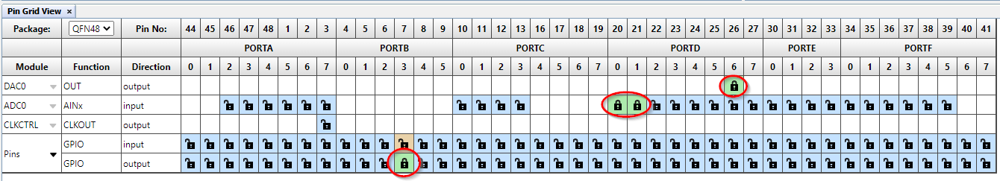
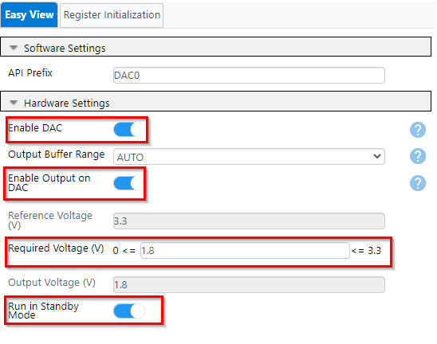
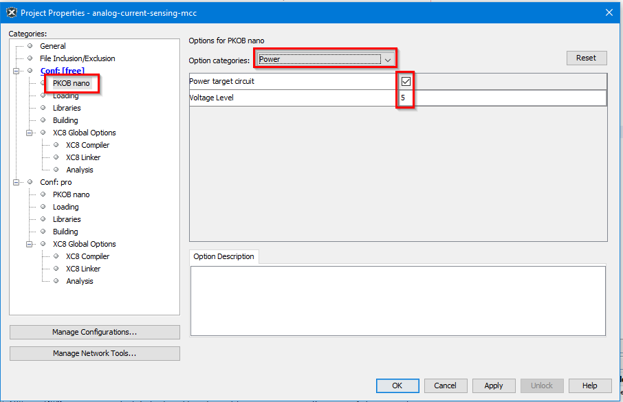
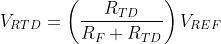

<!-- Please do not change this logo with link -->

# Low-Power AVR EA Resistance Temperature Detector (RTD) Measurements

This example uses the AVR EA microcontroller to periodically drive a Resistance Temperature Detector (RTD) with current, measure the voltage across the RTD, and calculate both the resistance and the temperature of the RTD. The only hardware needed in addition to the microcontroller is a 1.8 kΩ fixed resistor and the RTD itself.  

## Hardware Used

- [AVR64EA48 Curiosity Nano](https://www.microchip.com/en-us/development-tool/EV66E56A)
- RTD pt100 Sensor
- 1.8 kΩ Resistor

## Setup

- The DAC0OUT (PD6 on AVR EA) pin of the device must be connected to the VREFA (PD7 on AVR EA) pin of the device so that the Digital-to-Analog Converter (DAC) output can be used to provide the reference voltage for the Analog-to-Digital Converter (ADC)
- The 1.8 kΩ fixed resistor must be connected from the DAC0OUT (PD6 on AVR EA) pin to the ADC0 AIN0 (PD0 on AVR EA) pin
- The RTD must be connected from the ADC0 AIN0 (PD0 on AVR EA) pin to ground
- The ADC0 AIN1 pin (PD1 on AVR EA) must be connected directly to ground  

In order to measure the RTD, the DAC is enabled to produce an output of approximately 1.8V.  Since the DAC voltage is applied to a 1.8 kΩ fixed  resistor in series with the RTD, the current flowing through the RTD will be under 1 mA. A current under 1 mA prevents the RTD from any significant self-heating. The ADC is used to measure the voltage across the RTD, and this
allows the resistance and temperature of the RTD to be computed.  

## Peripherals Configuration using MPLAB® Code Configurator (MCC) Melody

Add the required peripherals: ADC0, DAC0, RTC and SLPCTRL. These are found under Drivers in the Device Resources window. Note that the peripheral VREF is added automatically when ADC0 or DAC0 is added, since these peripherals require the VREF peripheral. These System peripherals are added automatically: CLKCTRL, Configuration Bits, Interrupt Manager and Pins.

### System Configuration: CLKCTRL

- Set the Clock Selection to "Internal high-frequency oscillator"
- Enable the Prescaler
- Set Prescaler Division to "Divide by 2"

This will give a Main Clock of 10000000 Hz (10 MHz). Notice that the Timebase is automatically set to "10".  

### System Configuration: Interrupt Manager

- Turn on Global Interrupt Enable  

 

### System Configuration: SLPCTRL

- Enable sleep by turning on the "Enable Sleep" button
- Select "PDOWN" for Sleep Mode  

In addition, to use the sleep functions we need to include <code>"sleep.h"</code> from the compiler folder. We will do this later, as you first need to generate all the files for the project from MCC.

### System Configuration: Pin Configuration

- PORTB Pin 3 is set as ouput (LED0)
- PORTD Pin 0 and 1 are used by ADC0 as analog inputs
- PORTD Pin 6 is used by the DAC0 an output
- PORTD PIN 7 is used by VREFA input (not visible in the Pin Grid View)  

- PORTB pin 3 is renamed to "LED0" in Pin Configation to clarify that this pin is connected to LED0 on the Curiosity Nano board
- For all used pins Input/Sense Configuration (ISC) is set to "Digital Input Buffer Disabled" to save power  

## Peripherals Configuration

### VREF Configuration

- Set VDD to 3.3 (V)
- Enable Force DAC Voltage reference by turning on the "Enable Force Dac Voltage Reference" button
- Set DAC Voltage Reference source to "VDD as reference"  

### RTC Configuration

- Turn on Enable RTC
- Set Clock Select to "Internal 32.768 kHz Oscillator Divided by 32"
- Turn on Period Interrupt Timer (PIT)
- Under Periodic Interrupt Timer set Period Selection to "RTC Clock Cycles 512"
- Turn on Periodic Interrupt Enable  

### DAC0 Configuration

- Turn on Enable DAC
- Turn on Enable Output on DAC
- Set required voltage (V) to 1.8
- Enable "Run in Standby Mode"  

### ADC0 Configuration

In ADC Clock Settings:  

- Select Prescaler Value "System Clock Divided by 4"
- Set Sample Duration to 12  

In Hardware Settings:  

- Turn on Enable ADC
- Set mode to "BURST"
- Turn on Differential mode
- Set Sample numbers to 16 samples accumulated
- Set Start command to "Start a conversion immediately..."
- Set Reference select to "External Reference"
- Set first Analog Channel Selection Bits to "ADC input pin 0"
- Set second Analog Channel Selection Bits to "ADC input pin 1"
- Set Analog inputs Via to "Inputs connected via PGA"  

In PGA Control Settings:  

- Turn on Enable PGA
- Set PGA BIAS Select to 100% BIAS current
- Set Gain to 16x gain  

### Generating code using MCC Melody

Finally, after configuration is complete, click the **Generate** button in the Project Resources window.

  

### Adding Support for Sleep Functions

Finally, add support for sleep functions. The sleep instruction is issued to the device by writing "SLEEP" in assembler. Since MPLAB X is using C language, we need to define this in a function. Open the file <code>system.h</code> and enter <code>#include <avr/sleep.h></code> as shown in the image below.  

  

## Hardware Operation

- Connect the hardware together as seen in the schematic shown in the _Setup_ section  

## Changing Target Voltage on CNANO Board

To run the system clock at 20 MHz, the AVR64EA48 device need a supply voltage above 4.5V. The supply voltage for the microcontroller on the CNANO board is called "Target Voltage", and can be changed by going into the menu setting for the CNANO board using the Project Properties:

1. Select "PKOB nano"
2. Select "Power" from the "Option categories" drop-down menu
3. Check "Power target circuit" and write "5" to "Voltage Level"  

  

## Software Operation

- Connect the AVR6448 Curiosity Nano to a computer using a USB cable
- Clone the repository or download the zip to get the source code
- Open the project folder you want to run with MPLAB® X
- Set target voltage on CNANO board to 5V since system clock is running at 20 MHz (CNANO default is target voltage at 3.3V)
- Compile and run the code  

## Temperature Calculation

The resistance of the RTD varies in a known way as a function of temperature (T), in accordance with the following equations, where A, B, and C are constants associated with the specific RTD and R0 is the resistance of the RTD at a temperature of 0 Celsius:  

For T of 0°C or higher, R(T) = R0(1 + AT + BT2)  

For T of -200°C to 0°C, R(T) = R0(1 + AT + BT2 + CT3(T-100))  

If the resistance of the RTD is known, then the above formulas can be
used to determine the temperature.  

Here are the relevant formulas for determining the resistance of the RTD:  

First, the voltage across the RTD is determined by the voltage divider equation, where RF is resistance of the fixed resistor and RTD is resistance of the RTD:  

<!--
$$
V_{RTD} =\left ( \frac{R_{TD}}{R_{F} + R_{TD}}\right ) V_{REF}
$$
-->

The ADC digital result x, when the ADC is used in Differential mode, is
determined by the following equation (from the data sheet):  

<!--
$$
x = \left ( \frac{V_{RTD} \cdot G_{PGA}}{V_{REF}} \right) \cdot 2048
$$
-->
  

The voltage divider equation from above can be substituted in for VRTD and VREF cancels out:  

<!--
$$
x = \left ( \frac{R_{TD}}{R_{F}+R_{TD}} \right) \cdot G_{PGA} \cdot 2048
$$
-->
  

This equation can be solved for RTD, the resistance of the RTD:  

<!--
$$
R_{TD} = \frac{x \cdot R_{F}}{G_{PGA} \cdot 2048 - x}
$$
-->
  

Note that VREF does not appear in the equation at all, so errors in the reference voltage value will have no effect on the result.  The only parameters needed to compute the resistance of the RTD are the resistance value of the fixed resistor, the ADC result, and the PGA gain value.  

To minimize power consumption, the AVR EA is configured to stay in Power-Down Sleep mode whenever a measurement is not in progress. In this Sleep mode, AVR EA consumption was measured as approximately 0.9 µA (with VDD = 3.3V). The Periodic Interrupt Timer (PIT), a part of the Real Time Counter  (RTC), is set up to periodically generate an interrupt to bring the device out of Sleep mode.  When this happens, the DAC is enabled to produce an output voltage of 1.8V and the ADC is enabled. The ADC is commanded to start a differential conversion immediately.  

As soon as the ADC conversion is complete and the result is saved, DAC and ADC are disabled, the CPU performs the calculations necessary for converting the previous ADC value into resistance and temperature and puts the device to sleep.  

When the DAC and ADC are both enabled after the device comes out of Sleep, the DAC output stabilizes before the ADC is ready to start its first conversion, so there is no need for additional delays in the software.  

Various strategies were tested to minimize power consumption (higher/lower CPU+ADC clock speeds, PGA on/off with less/more conversions), but in this case the overriding issue is the fact that the DAC must supply nearly 1 mA of current to the RTD sensor while ADC  conversions are in progress. Therefore,  the best strategy is to run both the CPU and ADC as fast as possible (10 MHz and 5 MHz clocks, respectively) with maximum PGA gain so the conversion time, and the time that the DAC must supply 1 mA, is minimized.  With this  configuration, a burst of 16 ADC conversions takes only 119 µs.  

During that 119 µs of conversion time with DAC enabled, microcontroller supply current was measured as 8.0 mA (this includes what is needed by the DAC to drive the RTD, with VDD = 3.3V). Note that, if there is one conversion per second, the average current will be:  
119 µs / 1s × 8 mA = 1.19e-4 × 8 mA = 0.95 µA  

Measured average current consumption is 0.9 µA + (0.95 µA × n), where n is the number of RTD temperature measurements per second:  

|n         |Current Consumption (with VDD = 3.3V) |
|:--------:|------------------:|
|2         |2.8 µA |
|4         |4.7 µA |
|8         |8.5 µA |
|16        |16.0 µA  |
|32        |31.0 µA  |
|64        |62.0 µA  |  

**Note!** The measurements are taken from the bare metal example for the same setup, and not the actual code used with MPLAB X. The measurements will for this reason most likely differ from the measurements taken with the MPLAB X code due to the differences in code structure and also due to different compilers used.  
